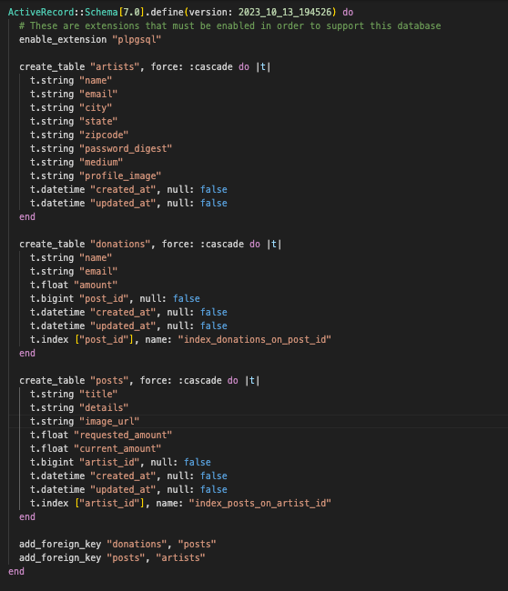

[](https://github.com/gearup-2305/gearUp-BE/graphs/contributors)
[](https://github.com/gearup-2305/gearUp-BE/forks)
[](https://github.com/gearup-2305/gearUp-BE/stargazers)
[](https://github.com/gearup-2305/gearUp-BE/issues)

# GearUp (Back-End Repo)

Link to [GearUP Website](https://gear-up-ui-ux.vercel.app/)
Link to [Front-End Repo](https://github.com/gearup-2305/gearUp-UI-UX)

### Table of Contents
1. [Setup](#setup)
2. [Project Description](#project-description)
3. [Usage](#usage)
4. [Database Schema](#database-schema)
5. [GraphQL Endpoint](#graphql-endpoint)
6. [Future Iterations](#future-iterations)
7. [Suggestions for Contribution](#suggestions-for-contribution)
8. [Contributors](#contributors)

### Setup
- Ruby 3.2.2
- Rails 7.0.7.2
- GraphQL
- SimpleCov gem for code coverage tracking
- ShouldaMatchers gem for testing assertions
- VCR / Webmock to stub HTTP requests in tests to simulate API interactions

### Built With
* 
* 
* 
* 
* 
* 
* 
* 

### Project Description
GearUP is a crowd funding app for artists to request supplies they need.  It is a full stack SOA application that utilizes GraphQL to communicate between the front and back end. The back end also utilizes Sidekiq and Action Mailer to send confirmation and update emails to its users. There is an option to create an account to add a new post, or donors can search and select a project to donate to without having to create an account.

### Usage
The backend app exposes a GraphQL API endpoint with data for performing queries and mutations for artists, their posts, and donations.  

### Database Schema


### GraphQL Endpoint

1. `POST /graphql`

**Queries:**<br>
All Artists:
```
query artists {
    artists {
        city
        createdAt
        email
        id
        medium
        name
        passwordDigest
        profileImage
        state
        updatedAt
        zipcode
      posts {
        id
        title
        details
        imageUrl
        requestedAmount
        currentAmount
        artistId
        donations {
          id
          name
          email
          amount
          postId
        }
      }
    }
}
```
One Artist:
```
query artist ($id: ID!) {
    artist (id: $id) {
        city
        createdAt
        email
        id
        medium
        name
        passwordDigest
        profileImage
        state
        updatedAt
        zipcode
      posts {
        id
        title
        details
        imageUrl
        requestedAmount
        currentAmount
        artistId
        donations {
          id
          name
          email
          amount
          postId
        }
      }
    }
}
```

**Mutations:**<br>
Create Post:
```
mutation {
  createPost(input:{
    title: "Example title",
    details: "Example details",
    imageUrl: "http://wiegand.test/jaye_reinger",
    requestedAmount: Float,
    currentAmount: Float,
    artistId: 1
  }) {
    post {
      id
      title
      details
      imageUrl
      requestedAmount
      currentAmount
    }
    errors
  }
}
```

Create Donation:
```
mutation UpdatePost {
  updatePost(input: {
    id: 1
    title: "I need "
    details: "Don't worry"
    imageUrl: "http://wiegand.test/jaye_reinger"
    requestedAmount: 3444.00
    currentAmount: 0
    artistId: 1
  }) {
    post {
      id
      title
      details
      imageUrl
      requestedAmount
      currentAmount
    }
    errors
  }
}
```

### Future Iterations
1. Add funcionality for payment processing using services such as PayPal, Venmo, Square, and/or Apple Pay
2. Utilize OAuth to create and login to account
3. Attach an AWS S3 Bucket for photo upload storage
4. Add either a `completed` or `duration` column to the `Posts` table in order to implement logic surrounding fundraiser/project completion.

### Suggestions for Contribution
If you would like to contribute to this project, please follow these steps:
1. Fork the repository
2. Create a new branch for your feature, e.g., `git checkout -b <your-feature>`
3. Commit your changes: `git commit -m "Add new feature`
4. Push the branch to your fork: `git push origin your-feature`
5. Create a pull request outlining your changes.

### Contributors 
- Allen Russell -GitHub: @garussell
- Anna Wiley -GitHub: @awiley33
- Andi Lovetto -GitHub: @andilovetto
- Matt Lim -GitHub: @MatthewTLim
